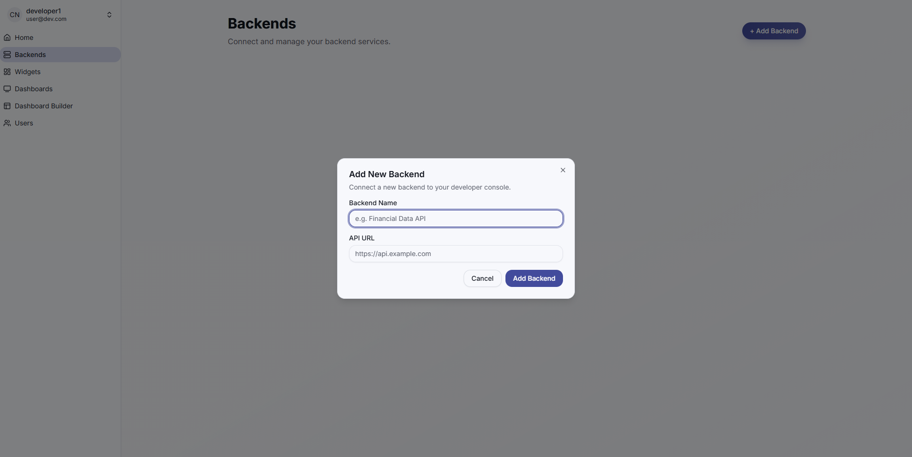
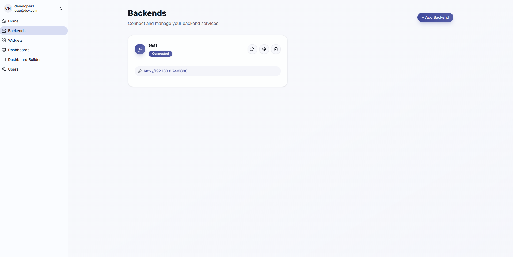
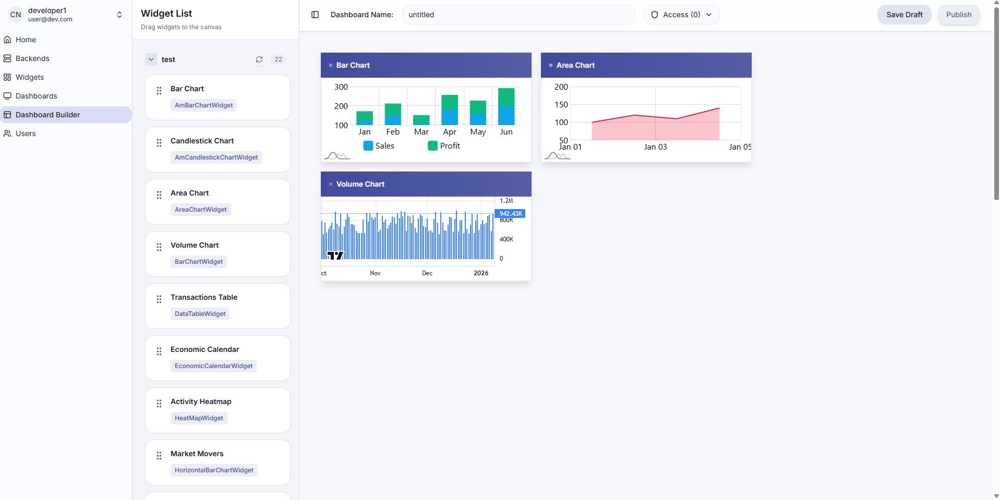

# Eagle Dev Console 🦅

Welcome to the Eagle Dev Console! This powerful tool allows developers to build dynamic dashboards using a visual drag-and-drop interface, powered by your own backend services.

## Getting Started

To use the Eagle Dev Console, you first need to connect your backend service that provides widget configurations and data.

### 1. Define Your Widgets

Your backend should expose an endpoint (typically `/widgets`) that returns a list of widget configurations. Each configuration follows this structure:

```json
{
  "name": "<Name of the widget on Dashboard>",
  "componentName": "<Name of the component from the widget Library>",
  "defaultProps": {
    "parameters": [
      { 
        "name": "symbol", 
        "label": "Symbol", 
        "type": "text", 
        "defaultValue": "CLc1", 
        "required": true 
      }
    ],
    "fetchMode": "manual"
  }
}
```

#### Key Properties:
- **`componentName`**: The specific widget type from the library (e.g., `MarketDepthWidget`, `LineChartWidget`).
- **`parameters`**: Defines a form within the widget to allow user input. These values are sent back to your backend when requesting data.
- **`fetchMode`**: 
  - `"auto"`: Data fetching is triggered automatically when parameters change.
  - `"manual"`: A "Apply" button is displayed, and data is only fetched when clicked.

#### Complete Configuration Example:

```json
{
  "name": "Order Book",
  "componentName": "MarketDepthWidget",
  "defaultProps": {
    "wsUrl": "ws://your-backend-api/ws/market-depth",
    "darkMode": true,
    "fetchMode": "manual",
    "parameters": [
      { 
        "name": "symbol", 
        "label": "Symbol", 
        "type": "text", 
        "defaultValue": "CLc1", 
        "required": true 
      }
    ]
  }
}
```

### 2. Implement Data Endpoints

Once your widgets are defined, you need to create endpoints to serve actual data. Below is a Python (FastAPI) example of a WebSocket endpoint that forwards requests to an external provider and sends updates back to the console.

```python
import json
import asyncio
import websockets
from fastapi import WebSocket, WebSocketDisconnect

@app.websocket("/ws/market-depth")
async def websocket_market_depth(websocket: WebSocket):
    await websocket.accept()
    external_url = "ws://external-data-provider/ws"
    
    try:
        async with websockets.connect(external_url) as external_ws:
            print(f"Connected to external WebSocket: {external_url}")
            
            # Forward messages from client (Console) to external server
            async def client_to_external():
                try:
                    while True:
                        data = await websocket.receive_json()
                        # Extract parameters defined in the widget config
                        symbols = data.get("params", {}).get("symbol")
                        if isinstance(symbols, str):
                            symbols = [symbols]

                        new_msg = {
                            "type": data.get("type"),
                            "symbols": symbols
                        }
                        await external_ws.send(json.dumps(new_msg))
                except WebSocketDisconnect:
                    print("Client disconnected")
                except Exception as e:
                    print(f"Error forwarding to external: {e}")

            # Forward messages from external server to client (Console)
            async def external_to_client():
                try:
                    while True:
                        data = await external_ws.recv()
                        data = json.loads(data)
                        if 'timestamp' in data:
                            send_data = {
                                "type": "update",
                                "data": data
                            }
                            await websocket.send_json(send_data)
                except Exception as e:
                    print(f"Error forwarding to client: {e}")

            # Run both tasks concurrently
            await asyncio.wait(
                [asyncio.create_task(client_to_external()), asyncio.create_task(external_to_client())],
                return_when=asyncio.FIRST_COMPLETED
            )
            
    except Exception as e:
        print(f"Could not connect to external websocket: {e}")
        await websocket.close()
```

### 3. Connect and Build

#### Step A: Add Your Backend
Navigate to the **Backends** page in the console and click **+ Add Backend**. Provide a name and the base URL of your API.



#### Step B: Manage Backends
You can view the connection status of your backends and refresh widget lists if you make changes on the server.



#### Step C: Design Your Dashboard
Head over to the **Dashboard Builder**. Your connected widgets will appear in the sidebar. Simply drag and drop them onto the canvas to start building your professional trader dashboard.



## Development

Run the frontend locally:

```bash
npm install
npm run dev
```

The application will be available at `http://localhost:5176`.
